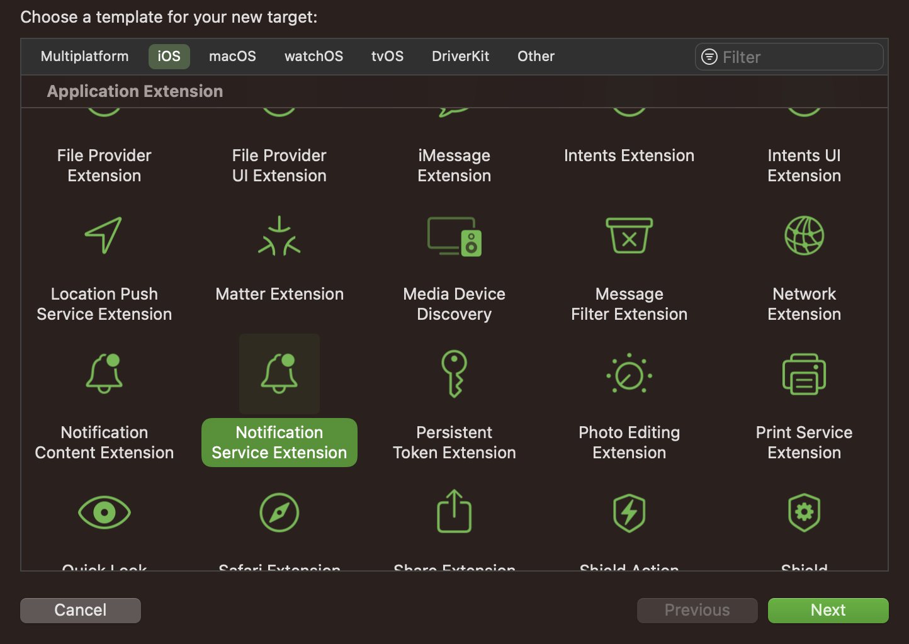
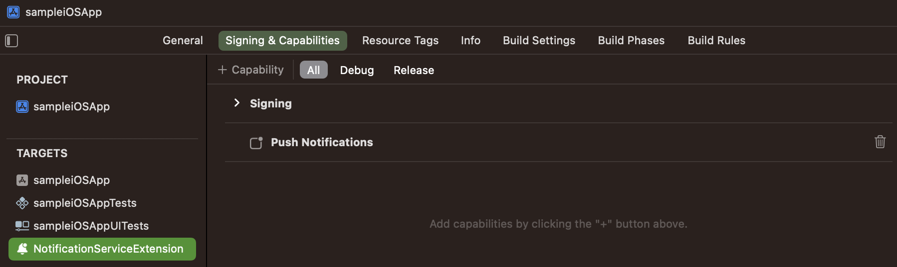
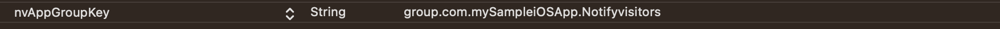
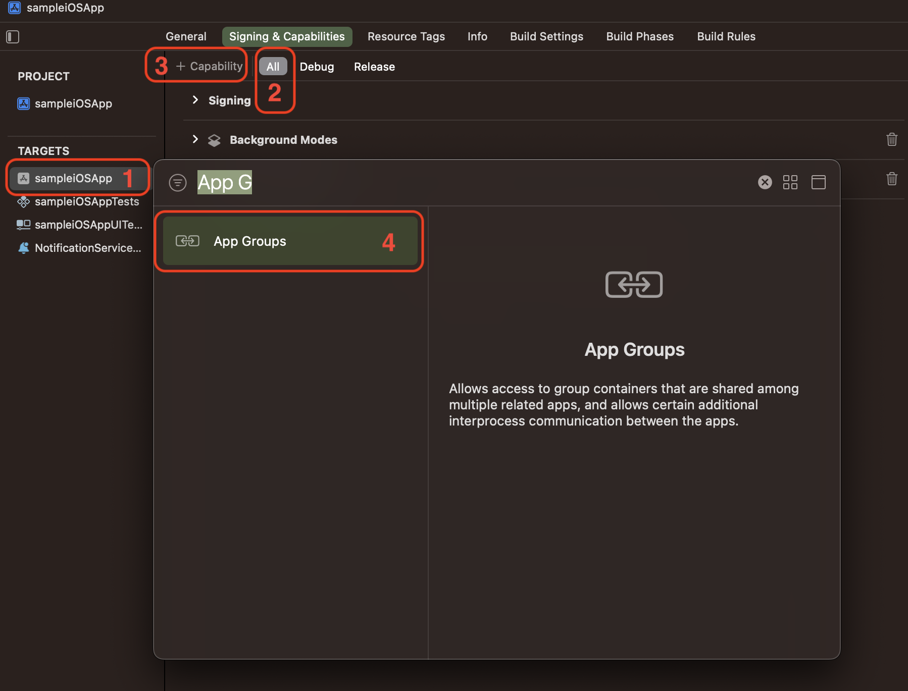
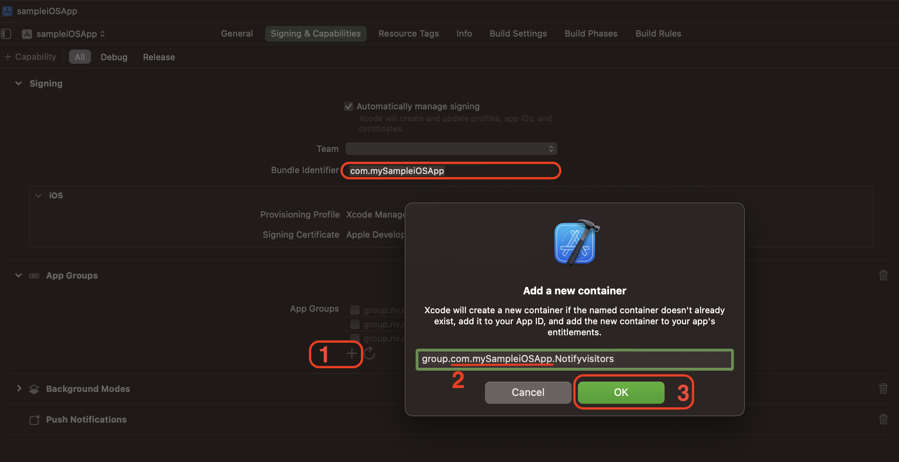
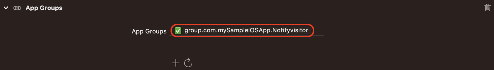

# Notification Service Extension (React Native iOS)

Notification Service Extension has been introduced in iOS 10 by Apple which allows you to add images, audio or video content to your push notification. NVECTA SDK will use it to enable you to add Action buttons, badge counts, and to track delivery counts in your NVECTA panel as well. So It is an Important step which you need to configure properly as described in this documentation.

Official Documentation:  
https://www.nvecta.com/docs/react-native-notification-service-extension

---

## 1. Add Notification Service Extension

**1.1.** Now, go to the iOS folder inside your `React Native Project's root folder` and open your iOS project in Xcode by double clicking on the `.xcworkspace` file and once your React Native iOS project is opened in Xcode, create `Notification Service Extension` in your project. To do so, go to `File >> New >> Target`.

**1.2** Now Select `Notification Service Extension` template under iOS section of the dialog box and click the next button to proceed.



**1.3** In the next prompt, provide the name of the extension target and select the programming language which you want to use and then click on the Finish button as shown in the screenshot below.


**1.4** Once the target is created, press 'Cancel' when prompted to activate the scheme. After this your notification service extension will be added to the project you will see a class with the extension name you specified during creation, as well as an info.plist file associated with it.

### Swift


<details>
    <summary>Objective-C</summary>


</details>

**1.5** Now we can proceed to add further configuration to this newly created target. Under this target you need to complete Import NVECTA SDK, Configure info.plist, add code to NotificationService file and configure AppGroup properly to complete this setup.

Further steps are defined below in detail to complete this setup.

## 2. Import NVECTA SDK in your Notification Service Extension:

**2.1.** Now close your react-native ios project that's opened in Xcode, then open the terminal and navigate to the ios folder located within your `React Native Project's` root folder using the `cd` command.

**For example** if your Project is saved on `Desktop` and its root folder name is `AwesomeProject`, then go to your project's ios folder by using the following command

```ruby
cd ~/Desktop/AwesomeProject/ios
```

**2.2.** Now go to ios folder inside your `React Native Project's` root folder, open your `Podfile` and add the `notifyvisitorsNotificationService` dependency at the end within the `Podfile` for your `Notification Service Extension` name `target` like below.

```ruby
target 'YourNotificationServiceExtension' do
     pod 'notifyvisitorsNotificationService'
end
```

**2.3** Now run the following commands in the terminal from the ios folder directory.

```ruby
npx pod-install ios
```

**2.4.** Now, re-open your React Native ios project in `Xcode` (by going to the ios folder present inside the `React Native Project's` root folder) and follow the steps mentioned below in `Xcode` itself to complete the remaining `Notification Service Extension` integration process.

### **2.5. Import the SDK**

If your Notification Service Extension is written in **Objective-C**, import the SDK header directly into your `NotificationService.m` file.

```objc
#import <notifyvisitorsNotificationService/notifyvisitorsNotificationService.h>
```

If your Notification Service Extension is written in **Swift**, create an **Objective-C Bridging Header** and import the SDK header to make the Objective-C APIs available to your Swift code.

Create a bridging header using the following naming convention:

```text
<NotificationServiceExtensionName>-Bridging-Header.h
```

For example, if your Notification Service Extension is named:

```text
MyNotificationServiceExtension
```

then the bridging header file should be:

```text
MyNotificationServiceExtension-Bridging-Header.h
```

Add the following import statement to the bridging header:

```objc
#import <notifyvisitorsNotificationService/notifyvisitorsNotificationService.h>
```

> **Note**
>
> Configure the bridging header path in your Notification Service Extension target:
>
> **Target → Build Settings → Swift Compiler - General → Objective-C Bridging Header**
>
> For example:
>
> ```text
> MyNotificationServiceExtension/MyNotificationServiceExtension-Bridging-Header.h
> ```
>
> A bridging header is only required when your Notification Service Extension is implemented in **Swift** and needs to access the Objective-C SDK APIs.

## 3. Configure the Notification Service Extension info.plist

Open your iOS project in Xcode, select the `Notification Service Extension` target, and open its `Info.plist` file as source code (right click on `info.plist` and click on `Open as >> Source code`) and add the following code in it.

```xml
<key>App Bundle identifier</key>
         <string>YOUR_APP_MAIN_TARGRT_BUNDLE_ID</string>
         <key>NSExtension</key>
         <dict>
                     <key>NSExtensionPointIdentifier</key>
                     <string>com.apple.usernotifications.service</string>
                     <key>NSExtensionPrincipalClass</key>
                     <string>$(PRODUCT_MODULE_NAME).NotificationService</string>
                     <key>NSExtensionAttributes</key>
                    <dict>
                               <key>UNNotificationExtensionDefaultContentHidden</key>
                               <true/>
                               <key>UNNotificationExtensionInitialContentSizeRatio</key>
                               <real>0.7</real>
                    </dict>
         </dict>
```

> **Important**
>
> The value of **App Bundle identifier** must exactly match the **Bundle Identifier** of your application's main target. An incorrect value may prevent the Notification Service Extension from communicating with the main application.

## 4. Configure Push in SignIn and Capabilities:

Go to `Signing & Capabilities` tab of your `Notification Service Extension` target and click on `+` symbol on the left corner of this tab and add `Push Notifications` and if you have upgraded `Xcode` and `Push Notifications` was already added in previous version of Xcode then remove `Push Notifications` and add it again to configure push notification properly for the upgraded devices.



## 5. Modify Push Payload in Notification Service Extension

Now you need to update the code to download and attach media content if available in your push payload to display rich media content (`image, audio or video`). To do so, go to your `NotificationService.swift/NotificationService.m` file and update the `didReceiveNotificationRequest()` method as shown below.

### Swift

```swift
override func didReceive(_ request: UNNotificationRequest, withContentHandler contentHandler: @escaping (UNNotificationContent) -> Void) {
    self.contentHandler = contentHandler
    bestAttemptContent = (request.content.mutableCopy() as? UNMutableNotificationContent)

    if let bestAttemptContent = bestAttemptContent {

        // Modify the notification content here…
        notifyvisitorsNotificationService.didReceive(request, withBestAttempt: bestAttemptContent, withContentHandler: self.contentHandler)

    }
}
```

</details>
<details>
    <summary>Objective-C</summary>

```objC
- (void)didReceiveNotificationRequest: (UNNotificationRequest *)request withContentHandler:(void (^)(UNNotificationContent * _Nonnull))contentHandler {

    self.contentHandler = contentHandler;
    self.bestAttemptContent = [request.content mutableCopy];

    // Modify the notification content here…

    [notifyvisitorsNotificationService didReceiveNotificationRequest: request withBestAttemptContent: self.bestAttemptContent withContentHandler: self.contentHandler];

}
```

</details>

<br>

Make sure `notifyvisitorsNotificationService.didReceive()` method of our SDK is called in the end of the `didReceiveNotificationRequest()` if you modify payload after calling this method then SDK may not work properly, so you can put some checks to identify your other payloads if you need to handle any.

Now in your same `NotificationService.swift/NotificationService.m` file update the `serviceExtensionTimeWillExpire()` method as shown below.

### Swift

```swift
override func serviceExtensionTimeWillExpire() {
    if let contentHandler = contentHandler, let bestAttemptContent =  bestAttemptContent {

        notifyvisitorsNotificationService.serviceExtensionTimeWillExpire()
    }
}
```

</details>
<details>
    <summary>Objective-C</summary>

```objC
- (void)serviceExtensionTimeWillExpire {

    [notifyvisitorsNotificationService serviceExtensionTimeWillExpire];

}
```

</details>

## ⚠️ Important Note

Once the above steps are completed, your app will be able to receive rich push. Action Buttons and badge counts can be displayed but till now delivery count is not enabled so you will see 0 as delivery count. To enable push delivery count in from your app to our panel, you need to follow the next step to configure AppGroup properly to enable delivery count.

# 6. Configure App Groups for All Targets:

Let's set up `AppGroups` in your app to count push deliveries in your NVECTA panel. First, we'll select an `AppGroupID` and set it up in each of the `info.plist` of your two targets (i.e. Your App's `Main Target` and Your `Notification Service Extension Target`), and then we'll use the same `AppGroupID` to create and activate the same `AppGroup` in both target’s `Signing & Capabilities` Tabs. To configure this way, follow the steps listed below.

**6.1.** Let’s assume the `AppGroupID` we want to use is `group.{Your App Bundle Identifier}.Notifyvisitors` where `{Your App Bundle identities}` is the same as your App Bundle Identifier of your Main App Target.

**6.2.** Now from the Project Navigator, go to your Main App project target, open `info.plist` as source code (right-click on `info.plist` and select `Open as >> Source code`), and paste the following code into it.

```xml
<key>nvAppGroupKey</key>
    <string>group.{Your App Bundle Identifier}.Notifyvisitors</string>
```

### OR

You can simply open the `info.plist`, add a new row, and define a `nvAppGroupKey` as a `String` with a value of `group.{your app bundle identifier}.Notifyvisitors`



**6.3.** Repeat `step 6.2` for the `info.plist` file in your `Notification Service Extension` Target project folder and enter the exact same key and values as in `step 6.2`.

## 📘 Note

Make sure it is `case sensitive` and is exactly the same in both the `info.plist` files.

**6.4.** Now, from the Project Navigator, select your app's Main Target and go to the `Signing & Capabilities` tab. If `App Groups` have not already been added, click `+ Capabilities` symbol in the left corner of this tab and add `App Groups`, as shown in the screenshot below.



**6.5.** Once you have finished adding `AppGroups` capabilities you will be able to see it in your `Signing & Capabilities` and then under `AppGroups` click `+` button to create a new app group with the same name as the value added to `info.plist` for both targets (i.e `group.{Your App Bundle Identifier}.Notifyvisitors`), as shown in the screenshot below. Finally, click OK.



**6.6. Example:** If you have set the `AppGroupID` to `group.com.mySampleiOSApp.Notifyvisitors` in both `info.plist` files, then add the same `AppGroup` to `Signing & Capabilities`, and ensure that this newly created `AppGroup` is checked (Turned On), as shown in the screenshot below.



**6.7.** Once you have configured `AppGroups` in your `Main App Target`, you must `activate` the same `AppGroup` in your `Notification Service Extension Target`. To do so, select your `Notification Service Extension target` from the Project Navigator and go to the `Signing & Capabilities` tab. If `AppGroups` have not already been added, click the `+ Capabilities` symbol in the left corner of this tab and add `App Groups` as shown in the screenshot below.


Once you've added `AppGroups capabilities`, you'll be able to see them in your `Notification Service Extension` Target's `Signing & Capabilities`. If a previously created `AppGroupID` isn't visible, click the refresh button next to the `+` symbol under `App Groups` to refresh the list of `AppGroups` configured in your Apple Developer account. Select the previously created app group and ensure that the same `AppGroupID` is checked (Turned on) in your `Notification Service Extension Target` as you did for your `Main App Target`.

**Example:** You have recently created an `AppGroupID` called `group.com.mySampleiOSApp.Notifyvisitors` for your `Main App Target`, and make sure the same `AppGroupID` is visible and checked (Turned On) in the `Signing & Capabilities` of your `Notification Service Extension Target`.


---

# Support

If you encounter any issues during integration:

- Contact the NVECTA Support Team.
- Raise a support request from the NVECTA Dashboard.
